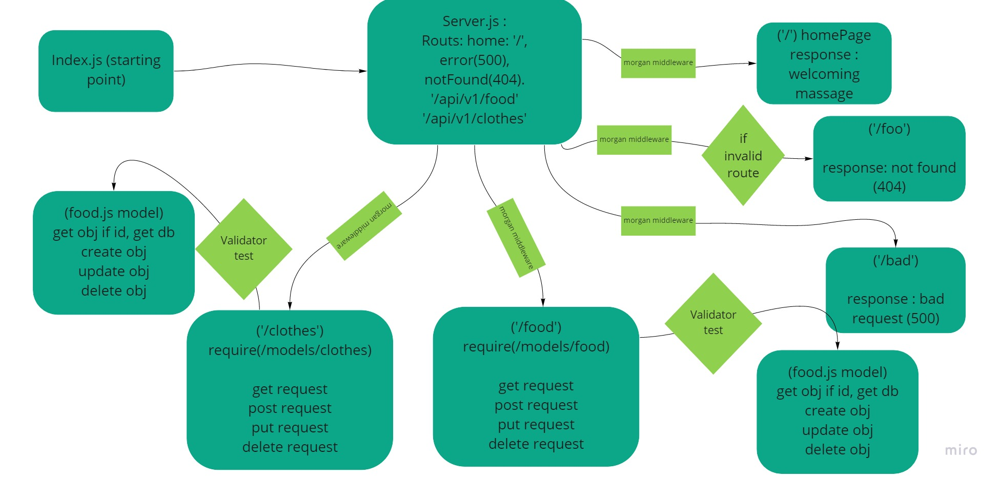

# basic-api-server

# basic-express-server

[The main heroku link](https://yasmeen-basic-api-server.herokuapp.com/)

[Pull_Request](https://github.com/yasmeenokh/basic-api-server/pull/3)

[The Repo Link](https://github.com/yasmeenokh/basic-api-server)

[GitHub Actions](https://github.com/yasmeenokh/basic-api-server/actions)

## Install
Clone the repository from GitHub
Run the command npm i dotenv express jest supertest to install dependencies
create .env file with PORT variable
## Test
Run the command npm test to test and verify the server and the middleware are working.
Run the command npm run test for testing .
## Run
Start the server using nodemon
Visit http://localhost:PORT at the PORT number you've assigned in your .env
## Routes 
1. https://yasmeen-basic-api-server.herokuapp.com/bad
2. https://yasmeen-basic-api-server.herokuapp.com/foo
3. https://yasmeen-basic-api-server.herokuapp.com/api/v1/food
4. https://yasmeen-basic-api-server.herokuapp.com/api/v1/clothes

## UML Diagram

